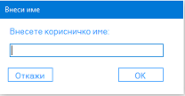
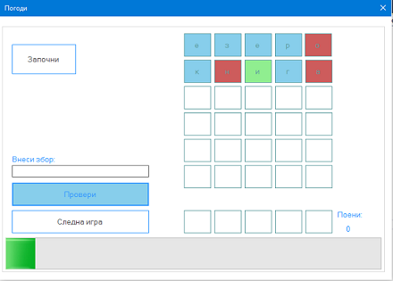
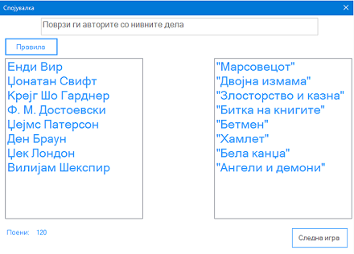
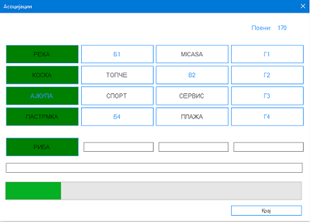
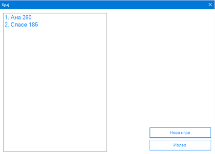

#QUIZ

Windows Forms Project By: Antonio Antovski, Ivan Stoickov and Darko Ilijevski

---
##1. Опис на апликацијата
Оваа апликација претставува еден облик на најдолго емитуваниот квиз на Балканот, "ТВ Слагалица". Во овој квиз има 5 различни игри: Погоди, Математика, Прашањa, Спојувалка и Асоцијации. По комплетирање на сите 5 игри, името на играчот заедно со бројот на поените што ги освоил се зачувуваат и се прикажуваат заедно со резултатите што ги оствариле претходните играчи.

##2. Опис на решението

Секоја игра е во посебна форма, а постои и форма за внесување на корисничко име како и форма за приказ на листата со резултати на крајот. Во секоја форма се чува објект од следната форма и се користи кога истата треба да се прикаже.

Во формата `Pogodi` базата на зборови се чува во листа `List<Char[]> words;`. Тие се чуваат како низа од карактери поради проверката што мора да се направи за секоја буква (е погодена и е на таа позиција, е погодена но е на друга позиција или таа буква ја нема во дадениот збор). Зборот кој треба да се погоди се избира од базата со помош на `Random` објект и се чува во низата од карактери `char[] guess`. За визуелен приказ на проверката се користи функцијата `public Color getColor(char[] word, int pos);`
```c#
   public Color getColor(char[] word, int pos) {
            if (word[pos] == guess[pos])
            {
                return Color.LightGreen;
            }
            else if (guess.Contains(word[pos]))
            {
                return Color.IndianRed;
            }
            else
            {
                return Color.SkyBlue;
            }
        }
```
Зависно од тоа дали е погодена буквата и нејзината позиција, позадината на тоа копче се променува во различна боја. Во оваа форма се користи и Progress Bar контрола која во комбинација со Timer контролата го прикажуваат преостанатото време за оваа игра.

Во формата `Matematika` со `Random` објект се генерира бројот што треба да го добиеме како и други шест броеви со чија помош треба да стигнеме до тој број. Со користење на `VBScript` скрипта од `Microsoft Script Control` библиотеката се пресметува внесениот израз од страна на корисникот.
Во функцијата `private void btnKraj_Click(object sender, EventArgs e)` се евалуира изразот и се додаваат поени зависно од тоа дали е добиен бараниот број, број кој се разликува најмногу за 5 од бараниот број или е добиен сосема погрешен резултат. 
И оваа игра е временски ограничена со Timer контрола.
```c#
	private void btnKraj_Click(object sender, EventArgs e)
        {
            MSScriptControl.ScriptControl sc = new MSScriptControl.ScriptControl();
            sc.Language = "VBScript";
            string expression = txtResenie.Text;
            object result = null;
            try {
                result = sc.Eval(expression);
            }
            catch (System.Runtime.InteropServices.COMException)
            {
                return;
            }
            if (result == null)
                return;
            txtKonecen.Text = result.ToString();
            DisableAll();
            int rez = Convert.ToInt32(txtKonecen.Text);
            int baran = Convert.ToInt32(txtBaranBroj.Text);
            if (rez == baran)
                this.points += 10;
            else if (Math.Abs(rez - baran) <= 5)
                this.points += 5;
            else
                this.points += 0;

            lblP.Text = this.points.ToString();
            progressBar1.Value = 100;
            btnKraj.Enabled = false;
            btnSledna.Enabled = true;
        }
```

Во формата `Prashanjа` прашањата и понудените одговори за истите се чуваат во `Dictionary<string, Answers> questions;` каде во `string` се чува прашањето а во објект од класата `Answers` се чуваат четирите понудени одговори за тоа прашање.
```c#
 class Answers {
        private List<string> answers;
        private string right;

        public Answers(string fi, string s, string t, string f) {
            answers = new List<string>()
            {
                fi, s, t, f
            };

            right = fi;
        }

        public string getRightAnswer() {
            return right;
        }

        public List<string> getAnswers() {
            return answers;
        }
    }
```
Во функцијата`Check()` се проверува дали се генерирале 10 прашања и се повикува `timer1.Stop()`, инаку се генерира следното прашање. Помошната функција`RandomValues(int num, int min, int max);` се користи за да се генерираат различни прашања и различен редослед на понудените одговори за истите.

Во формата `Spojuvalka` најпрво со `Random` објект се одбира категоријата од која корисникот ќе треба да поврзува поими, а потоа со функцијата `populateLists(int rr, out List<Poim> p1, out List<Poim> p2)` се пополнуваат две листи со соодветните поими од категоријата и во различен редослед се распоредуваат во два графички ListBox контроли. Со промена на селектираниот поим во листите се повикува функцијата `check();` во која се проверува дали двата поими имаат иста вредност на својството `Ind`. Ако имаат иста вредност се повикуваат методите `fillLeft();`, `fillRight();` и `addPoints();`.
```c#
  private void fillLeft()
        {
            /// <summary>
            /// Во нова листа ги внесуваме поимите од ListBox-от 
            /// </summary>
            List<Poim> tempList = new List<Poim>();
            for (int i = 0; i < lstLevo.Items.Count; i++)
            {
                tempList.Add(lstLevo.Items[i] as Poim);
            }
            /// <summary>
            /// Го бришеме селектираниот поим
            /// </summary>
            Poim qwe = lstLevo.SelectedItem as Poim;
            tempList.Remove(qwe);

            /// <summary>
            /// Креираме нова листа во која ги внесуваме поимите без претходно избришаниот
            /// </summary>
            List<Poim> tempList2 = new List<Poim>();

            for (int i = 0; i < tempList.Count; i++)
                tempList2.Add(new Poim { Value = tempList[i].Value, Ind = tempList[i].Ind });

            /// <summary>
            /// Во ListBox контролата ја додаваме новодобиената листа
            /// </summary>
            lstLevo.Items.Clear();
            lstLevo.Items.AddRange(tempList2.ToArray());
            lstLevo.DisplayMember = "Value";
            lstLevo.ValueMember = "Ind";
        }
```
Со функциите `fillLeft();` и `fillRight();` се бришат соодветните погодени поими од двата ListBox-a и се прикажуваат останатите поими кои треба да се погодат. Доколку при повик на функцијата `check()` елементите имаат различни вредности на својството `Ind` се повикува функцијата `takePoints()`. Кога сите поими ќе се погодат се прикажуваат истите но редоследно според индексот за корисникот да може да разгледа кој со кој поим требало да ги поврзе.

Во формата `Asocijacii` со помош на објекти од класата `Asocijacija` се чуваат по 4 поими во 4 колони чиишто решенија водат до конечното решение на играта.
```c#
 public class Asocijacija
    {
        public string[] A { get; set; }
        public string[] B { get; set; }
        public string[] V { get; set; }
        public string[] G { get; set; }
        public string Konecno { get; set; }

        public Asocijacija(string[] A, string[] B, string[] V, string[] G, string Konecno)
        {
            this.A = A;
            this.B = B;
            this.V = V;
            this.G = G;
            this.Konecno = Konecno;
        }
    }
```
Со `KeyPress(object sender, KeyPressEventArgs e)` функцијата се проверува текстот што корисникот го внесува во еден TextBox, ако текстот е поимот што се бара позадината на тој TextBox се променува во друга боја. Ако тоа не е случај се испразнува содржината на TextBox-от за следниот обид на корисникот. Доколку корисникот го погоди поимот зависно од бројот на обиди му се доделуваат поени. И оваа игра е временски ограничена.
При повик на функцијата `btnKrajClick(object sender, EventArgs e)` се запишува резултатот на корисникот во датотеката "rezultati.txt" и се прикажува нова форма `Kraj` во која има листа на сите дотогаш остварени резултати.

##3. Упатство за употреба
###3.1 Почетна
 
При стартување на апликацијата се отвара почетниот прозорец каде за да започнеме нова игра се клика на копчето "Нова игра" по што корисникот треба да внесе корисничко име и да кликне на копчето "ОК".
Потоа се отвара формата со првата игра "Погоди".
###3.2 Погоди

Целта на играта е да се погоди бараниот збор од 5 букви во шест обиди за одредено време. Тука корисникот најпрво треба да кликне на копчето "Започни". Потоа треба да внесува зборови од 5 букви да кликне на копчето "Провери". следејќи ги боите на полињата што се наоѓаат на десната страна да се обиде да го погоди бараниот збор.
* Зелена боја - буквата се наоѓа во бараниот збор и таа е на точна позиција
* Црвена боја - буквата се наоѓа во бараниот збор но таа не е на точна позиција
* Сина боја - буквата не се наоѓа во бараниот збор

Копчето "Следна игра" води до играта "Mатематика".
###3.3 Математика

Во оваа игра корисникот треба за одредено време да го добие бараниот број (1-999) со помош на броеви: првите четири се едноцифрени, петтиот може да биде 10, 15 или 20, а шесттиот 25, 50, 75 или 100. Откако корисникот ќе кликне на копчето "Старт" времето за решавање започнува. Со клик на достапните броеви и оператори корисникот го формира изразот и пред истекот на времето треба да кликне на копчето "Крај" за да провери дали го добил бараниот број. Со клик на копчето "Следна игра" корисникот пристапува кон играта "Прашања".
###3.4 Прашања

Играта "Прашања" се состои од 10 прашања од разни области и 4 понудени одговори за секое прашање од кои само еден одговор е точен. Корисникот за секој точен одговор добива 10 а губи 5 поени за неточно одговорено прашање. По изминување на времето за оваа игра корисникот не може да одговара евентуално неодговорени прашања. Копчето "Следна игра" води кон играта "Спојувалка".
###3.5 Спојувалка

Во играта "Спојувалка" потребно е да се поврзат соодветно поимите од листата на лево со поимите од листата на десната страна. Секое точно поврзување на два поими се наградува со 10 поени, а за секое погрешно поврзување се одземаат 5 поени. Кога сите поими ќе бидат поврзани корисникот може да кликне на копчето "Следна игра".
###3.6 Асоцијација

Во оваа игра корисникот треба за ограничено време да го погоди конечното решение на асоцијацијата. Има 4 колони со по 4 полиња кои корисникот може да ги отвори со клик и со нивна помош да ги погоди поимите под соодветните колони кои асоцираат на конечното решение на асоцијацијата. Со клик на копчето "Крај" се прикажува резултатот на тековниот корисник заедно со сите дотогашни резултати.
###3.7 Крај

Тука освен прегледот на постигнатите резултати корисникот може да излезе од апликацијата или да започне нова игра со клик на копчето "Нова игра".

###3.8 Правила
ааа
